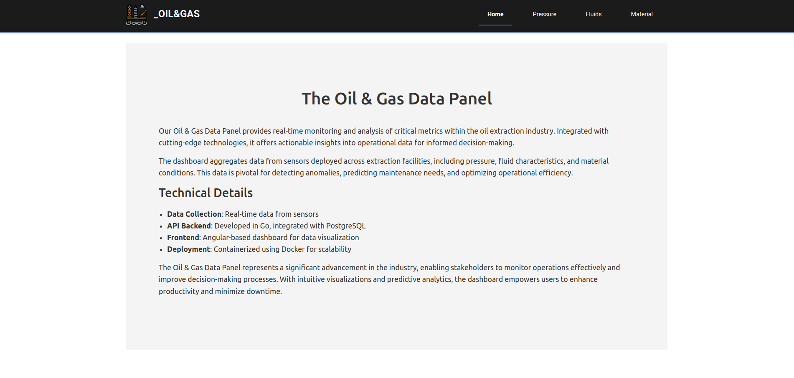
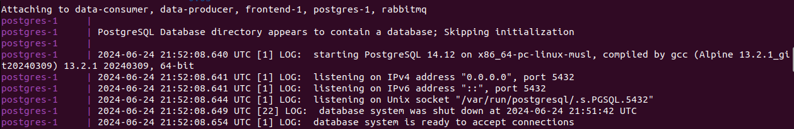

# Oil & Gas Monitoring System

This project comprises a backend API and a frontend interface for monitoring equipment data in an oil & gas environment. 

The backend has 4 services: 

- data-producer (Python)
- RabbitMQ
- PostgreSQL
- data-consumer (Go) 

The frontend has 1 service:
- frontend (Angular with Chart.js and Bootstrap)

**This is an ongoing application, under construction.**




## Author

Barbara Calderon, software developer.

- [Github](https://www.github.com/barbaracalderon)
- [LinkedIn](https://www.linkedin.com/in/barbaracalderondev)
- [Twitter](https://www.x.com/bederoni)

### Technologies Used

- Python programming language
- Golang programming language
- Typescript programming language
- RabbitMQ
- PostgreSQL
- Angular
- Chart.js
- Bootstrap
- Docker
- Docker Compose

## Project Objectives

The primary goals of the Oil & Gas Panel System project are as follows:

1. **Data Producer**: Developed in Python, simulates real-time data from sensors in a centrifugal oil pump, including metrics like timestamp, suction_pressure (psi), discharge_pressure (psi), flow_rate (gpm), fluid_temperature (Celsius), bearing_temperature (Celsius), vibration (mm/s), impeller_speed (rpm), lubrication_oil_level (mm), and npsh (m). The producer sends data to the message broker.

   

2. **Message Broker**: Integrates with RabbitMQ for real-time data ingestion and processing, using the oil_exchange bound to oil_queue.

   
   
   

3. **Data Consumer**: Developed in Golang, consumes messages from the RabbitMQ oil_queue and inserts data into the PostgreSQL database via an API endpoint (POST /oil-data). The consumer also provides API endpoints (/pressure, /material, and /fluid).

   

4. **PostgreSQL**: The PostgreSQL database 'oil' stores equipment data in the EquipmentData table.

   
   

5. **Visual Graph on Data**: Develops a frontend interface using Angular, Chart.js, and Bootstrap to visualize equipment metrics using charts and tables.

6. **Docker and Docker Compose**: Uses Docker and Docker Compose for containerization and deployment.

## Overview

The Oil & Gas Panel System provides a comprehensive solution for monitoring equipment parameters such as pressure, material status, and fluid conditions in real-time. The backend API is built with Go and Gin, leveraging RabbitMQ for data ingestion. The frontend interface, developed with Angular, offers intuitive visualization of equipment metrics.

## Backend API

The backend API built with Golang serves as the core of the Oil & Gas Panel System, offering endpoints to retrieve equipment data and integrate with external systems.

### API Endpoints

| Method | Endpoint          | Description                                    |
|--------|-------------------|------------------------------------------------|
| GET    | /pressure         | Retrieve equipment pressure data                |
| GET    | /material         | Retrieve equipment material status data         |
| GET    | /fluid            | Retrieve equipment fluid condition data         |
| POST   | /oil-data         | Post new equipment data                        |

### Example:


## Run Locally

To run the Oil & Gas Panel System locally, follow these steps:

1. Make sure you have Docker e Docker Composed installed on your machine.

2. Clone this repository:

```bash
git clone git@github.com:barbaracalderon/oil-pump.git
```

3. Navigate to the project directory:

```bash
cd oil-pump
```

4. Execute the Docker Compose command to run the containers:

```bash
docker compose up --build
```

5. Access the Golang API at:

```bash
localhost:8080
```

6. Access the RabbitMQ dashboard at:

```bash
localhost:5672
user = 'guest'
password = 'guest'
```

7. Access the Angular frontend at:

```bash
localhost:4200
```

8. To access the PostgreSQL database via Pg4Admin (to view database content), use:

```bash
database = 'oil'
user = 'postgres'
password = 'example'
localhost:5434
```

## Final considerations

The Oil & Gas Monitoring System aims to provide a solution for monitoring equipment metrics, enhancing operational efficiency in oil & gas environments. Developed using modern technologies such as Go, Angular, and Docker, the system ensures scalability, performance, and ease of deployment.

We welcome feedback and contributions to further improve and expand the capabilities of this system.

**Still under construction.**

Regards,

Barbara Calderon.